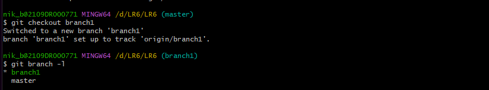
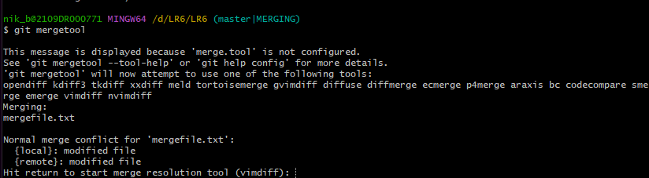
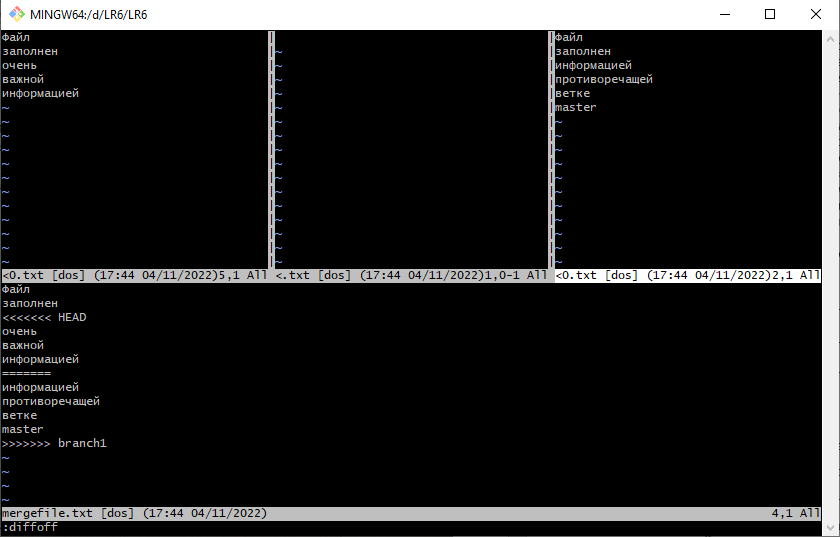
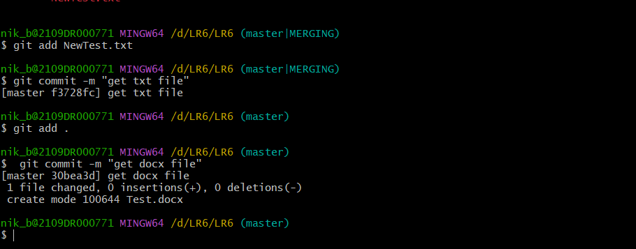
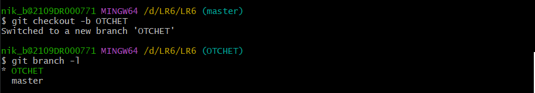

# LR6
Лабораторная работа №6

### Создание корневой папки LR6
### инициализация --global user.name user. email.
Рисунок №1


Рисунок №2


### Клонирование удаленного репозитория


Рисунок №3


### Добавление файла с GitHub на лок репозиторий


Рисунок №4


### История коммитов ветки b master.
Рисунок №5


### переход на ветку branch1 и обзор веток

Рисунок №6



### лог для ветки branch1
Рисунок №7


### переход на ветку master и попытка слияния

Рисунок №8


### Решение конфликта при помощи mergetool

Рисунок №9



### Переход в редактор Vim. Изменение файла с помощью команды :diffoff
Рисунок №10


### Результат работы в редакторе Vim
Рисунок №11



### Результат слияния и появление файла add, который впоследствии был удален вручную из директории
Рисунок №12


### Создание доп файлов
Рисунок №13


### Добавление новых файлов через add и commit

Рисунок №14



### Откат на один commit назад
Рисунок №15


### Удаление ветки branch1
Рисунок №16


### Создание новой ветки OTCHET
Рисунок №17



### Создание отчета в файле Readme.md с использованием редактора VScode

Рисунок №18


## ЛОГ КОМАНД
```
$ cd D:/LR6
$ git clone 
$ git pull
$ cd LR6
$ git log
$ git checkout branch1
$ git branch1 -l
$ git log
$ git checkout master
$ git merge branch1
$ git mergetool
$ git status
$ git add NewTest.txt
$ git commit -m 'get txt file'
$ git add .
$ git commit -m 'get docx file'
$ git reset --hard HEAD~1
$ git branch -d branch1
$ git branch -l
$ git checkout -b 'OTCHET'
$ git branch -l
````
